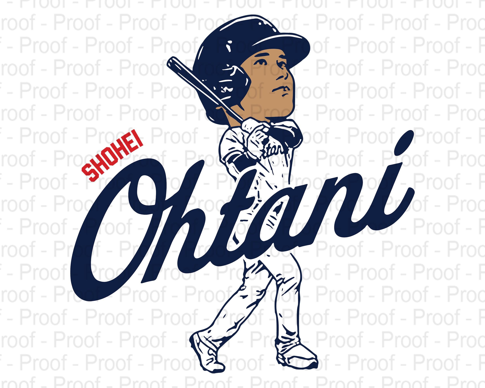

My new test xx

<!-- Liquid:  statements -->

<!-- Include submenu from _includes to top of pages -->

<!--- Concatenation of site URL to frontmatter image  --->

<!--- Has is a list variable containing mario metadata for sprite --->
  
<!--- Size width/height of Sprit images --->


<!--- HTML for page contains <p> tag named "Mario" and class properties for a "sprite"  -->

<p id="mario" class="sprite"></p>
  
<!--- Embedded Cascading Style Sheet (CSS) rules, 
        define how HTML elements look 
--->
<style>

  /*CSS style rules for the id and class of the sprite...
  */
  .sprite {
    height: {{pixels}}px;
    width: {{pixels}}px;
    background-image: url('{{sprite_file}}');
    background-repeat: no-repeat;
  }

  /*background position of sprite element
  */
  #mario {
    background-position: calc({{animations[0].col}} * {{pixels}} * -1px) calc({{animations[0].row}} * {{pixels}}* -1px);
  }
</style>

<!--- Embedded executable code--->
<script>
  ////////// convert YML hash to javascript key:value objects /////////

  var mario_metadata = {}; //key, value object
    
  
  var key = "{{key | first}}"  //key
  var values = {} //values object
  values["row"] = {{key.row}}
  values["col"] = {{key.col}}
  values["frames"] = {{key.frames}}
  mario_metadata[key] = values; //key with values added

  

  ////////// game object for player /////////

  class Mario {
    constructor(meta_data) {
      this.tID = null;  //capture setInterval() task ID
      this.positionX = 0;  // current position of sprite in X direction
      this.currentSpeed = 0;
      this.marioElement = document.getElementById("mario"); //HTML element of sprite
      this.pixels = {{pixels}}; //pixel offset of images in the sprite, set by liquid constant
      this.interval = 100; //animation time interval
      this.obj = meta_data;
      this.marioElement.style.position = "absolute";
    }

    animate(obj, speed) {
      let frame = 0;
      const row = obj.row * this.pixels;
      this.currentSpeed = speed;

      this.tID = setInterval(() => {
        const col = (frame + obj.col) * this.pixels;
        this.marioElement.style.backgroundPosition = `-${col}px -${row}px`;
        this.marioElement.style.left = `${this.positionX}px`;

        this.positionX += speed;
        frame = (frame + 1) % obj.frames;

        const viewportWidth = window.innerWidth;
        if (this.positionX > viewportWidth - this.pixels) {
          document.documentElement.scrollLeft = this.positionX - viewportWidth + this.pixels;
        }
      }, this.interval);
    }

    startWalking() {
      this.stopAnimate();
      this.animate(this.obj["Walk"], 3);
    }

    startRunning() {
      this.stopAnimate();
      this.animate(this.obj["Run1"], 6);
    }

    startPuffing() {
      this.stopAnimate();
      this.animate(this.obj["Puff"], 0);
    }

    startCheering() {
      this.stopAnimate();
      this.animate(this.obj["Cheer"], 0);
    }

    startFlipping() {
      this.stopAnimate();
      this.animate(this.obj["Flip"], 0);
    }

    startResting() {
      this.stopAnimate();
      this.animate(this.obj["Rest"], 0);
    }

    stopAnimate() {
      clearInterval(this.tID);
    }
  }

  const mario = new Mario(mario_metadata);

  ////////// event control /////////

  window.addEventListener("keydown", (event) => {
    if (event.key === "ArrowRight") {
      event.preventDefault();
      if (event.repeat) {
        mario.startCheering();
      } else {
        if (mario.currentSpeed === 0) {
          mario.startWalking();
        } else if (mario.currentSpeed === 3) {
          mario.startRunning();
        }
      }
    } else if (event.key === "ArrowLeft") {
      event.preventDefault();
      if (event.repeat) {
        mario.stopAnimate();
      } else {
        mario.startPuffing();
      }
    }
  });

  //touch events that enable animations
  window.addEventListener("touchstart", (event) => {
    event.preventDefault(); // prevent default browser action
    if (event.touches[0].clientX > window.innerWidth / 2) {
      // move right
      if (currentSpeed === 0) { // if at rest, go to walking
        mario.startWalking();
      } else if (currentSpeed === 3) { // if walking, go to running
        mario.startRunning();
      }
    } else {
      // move left
      mario.startPuffing();
    }
  });

  //stop animation on window blur
  window.addEventListener("blur", () => {
    mario.stopAnimate();
  });

  //start animation on window focus
  window.addEventListener("focus", () => {
     mario.startFlipping();
  });

  //start animation on page load or page refresh
  document.addEventListener("DOMContentLoaded", () => {
    // adjust sprite size for high pixel density devices
    const scale = window.devicePixelRatio;
    const sprite = document.querySelector(".sprite");
    sprite.style.transform = `scale(${0.2 * scale})`;
    mario.startResting();
  });

</script>


My journey starts here.

### Markdown Samples [markdown cheatsheet](https://www.markdownguide.org/getting-started/)

>Using markdown from Index.md. We are learning markdown.

- This text below is something called Markdown. This is a heading, Inside of code is called scaffolding

```markdown
## Investing in Your Technical Future XXXYYY
```

-This is emphasis

```

> Explore the Computer Science Pathway at Del Norte High School and invest in your technical skills. All Del Norte CompSci classes are designed to provide a real-world development experience. Class time includes tech talks (lectures), peer collaboration, communication with teachers, critical thinking while coding, and creativity in projects. Grading is focused on time invested, participation with peers, and engagement in learning.
```


- Sample of bullets
  
```markdown

- Introduction to concepts and requirements by the teacher
- Project-based learning with teacher support, performing Agile/Scrum development
- Coding, frontend, backend, DevOps, version control and algorithmic thinking
- Creativity, research, design, data structures, and utilizing ChatGPT
- Performing team work, team communication and collaboration, peer reviews/grading
- Focus on technical communications through project presentations and student led teaching
- Grade are on projects, learnt concepts, and live reviews between student(s) and teacher
```

%%html

<h3>HTML: This is a Heading</h3>
<p>This is a paragraph.</p>

<a href="https://myapps.classlink.com/home">My Plan</a>




<a href="a href=">link">link text</a> 

**Bolded Text in HTML**
<strong>Bolded Text in HTML</strong>
*Italic Text in Markdown*
<i>Italic Text in HTML</i>
<p> This is a paragraph in HTML markdown does not have these following formats</p>
<button>some button text</button>

<p>text here<p>
<button><a href="https://www.perfectgame.org/Players/Playerprofile.aspx?ID=836018">Big Sun</a></button>
<div>
<button><a href="https://www.youtube.com/watch?v=jNZBUGLbvOw">Lakers</a>
<div>
<button><a href="https://sites.google.com/site/populardoodlegames/doodle-baseball">Google Baseball</a>
</div>
<p>insert text here</p>

<!-- first information -->
<div>
    <!-- notice how tags can be put INSIDE eachother -->
    <p>This is the first paragarph of section 1</p>
    <p>This is the second paragraph of section 1</p>
</div>

<!-- second information -->
<div>
    <!-- notice how tags can be put INSIDE eachother -->
    <p>This is the first paragarph of section 2</p>
    <p>This is the second paragraph of section 2</p>
</div>

<!-- from https://github.com/utterance/utterances -->
<script src="https://utteranc.es/client.js"
        repo="nighthawkcoders/portfolio_2025"
        issue-term="title"
        label="blogpost-comment"
        theme="github-light"
        crossorigin="anonymous"
        async>
</script>

